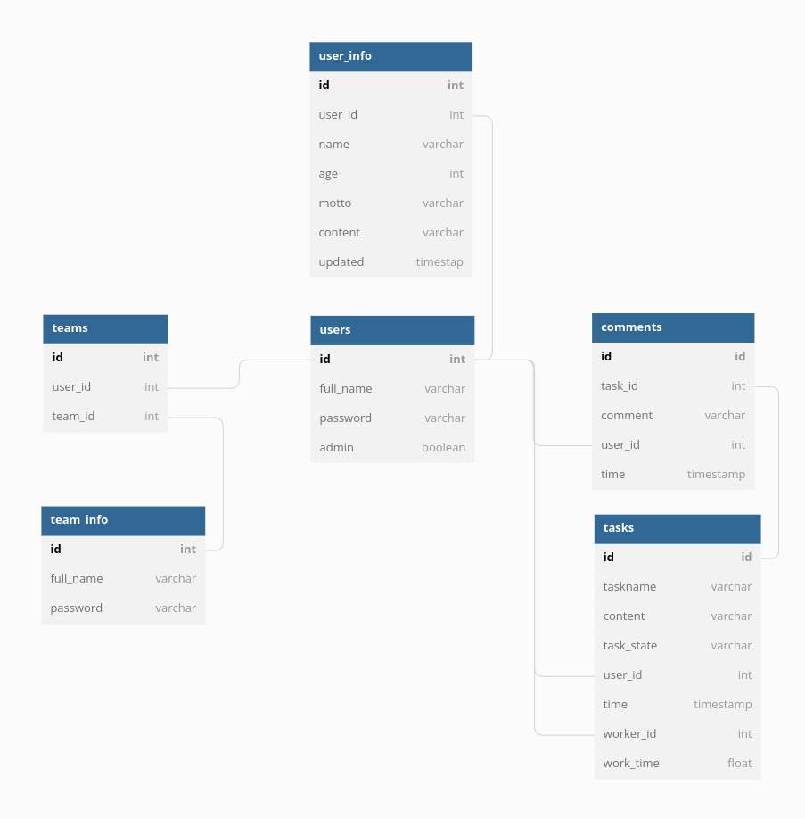

# tsoha-nenonen
Tsoha, course exercise, summer 2022

heroku link: https://voluntee-app.herokuapp.com/

STATUS 
-- 21.8.2022
 - You can make a team and others can join it with correct password
 - You can leave comments into tasks
 - using css and bootstrap
 
 In progress: profile pages and messages between two users, searches
 
 DB sketch: 
 

-- 7.8.2022
 - It is possible to make an account 
 - You can login with the account
 - You can make a new task
 
In progress: commenting on each task

-------------------------------------------------------------------

This exercise is done using flask with python and postregreSQL.

This application is developed with a working name "voluntary app".
It is variation of a classical todo application for voluntary work.
The admins can create todos and voluntees can pick ones suitable for them.

1. Admin/User can register with a username and password.

2. Admin can make new todos and remove existing ones.
    - todo_id
    - admin username
    - todo name
    - todo description
    - deadline
    - date of creation
    - Default state: todo 
    - Default voluntee name that has picked the todo: none
    - Default visibility: visible

3. User can pick a task to do.
     voluntee name: none -> username
     state: todo -> working

4. User can mark a task done.
    state: working -> done

4. Users can comment todos.
    - todo_id
    - username
    - message

5. User can filter todos on different criteria:
   - admin name
   - todo states
   - todos containing specific words in name/description
   - comments containing specific words

---------------------------------------------------------------------

UI 

Login page: 
            - login with username and password --> list page 
            - register --> register page --> login page

Register page:
            - give username, password x2, user/admin
            - check no duplicate usernames, give error otherwise
            - return to login page
            
list page: 
            - list all todos, state: todo
            - select a todo --> todo page
            - filtering happens here
            
todo page:
            - leave a message
            - marked todo into different state: working/done
            

---------------------------------------------------------------------

Database tables:

            - Admins
            - Users
            - TODOs --> this will be split up to manage searching/filtering
            - Messages

